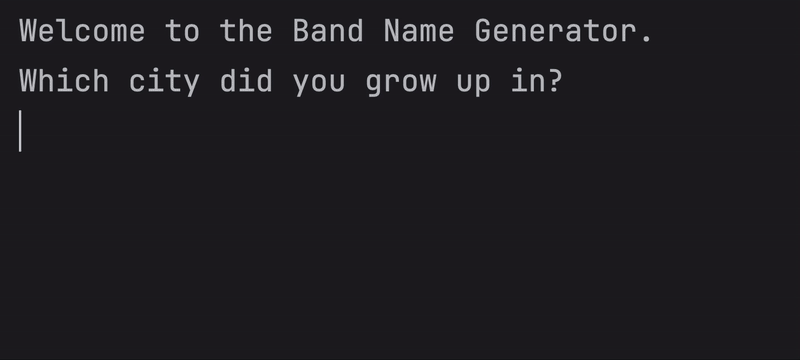

# Day 1 - Getting Started with Basic Operations and Troubleshooting
## Concepts Learned
- Printing
- Commenting
- Debugging
- Taking user Inputs
- String manipulation
- Variables & Variable Naming
## Band Name Generator

