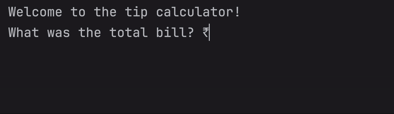

# Day 2 - Understanding Data Types and How to Manipulate Strings
## Concepts Learned
- Python Primitive Data Types
- Type Error, Type Checking and Type Conversion
- Mathematical Operations in Python
- Number Manipulation and F Strings in Python
## Tip Calculator
### Calculates how much each person should pay after splitting a bill, including tip percentage.

