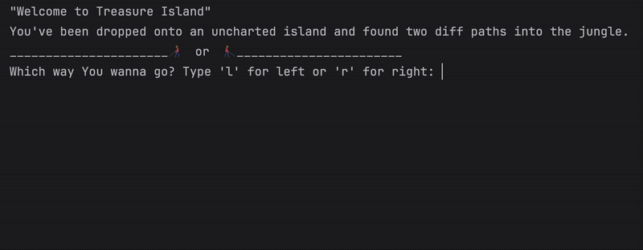

# Day 3 - Control Flow and Logical Operators
## Concepts Learned
- Control Flow with if / else and Conditional Operators
- Modulo Operator
- Nested if statements and elif statements
- Multiple If Statements in Succession
- Logical Operators
## Treasure Island
### A simple text-based adventure game where choices lead to winning or game over.

