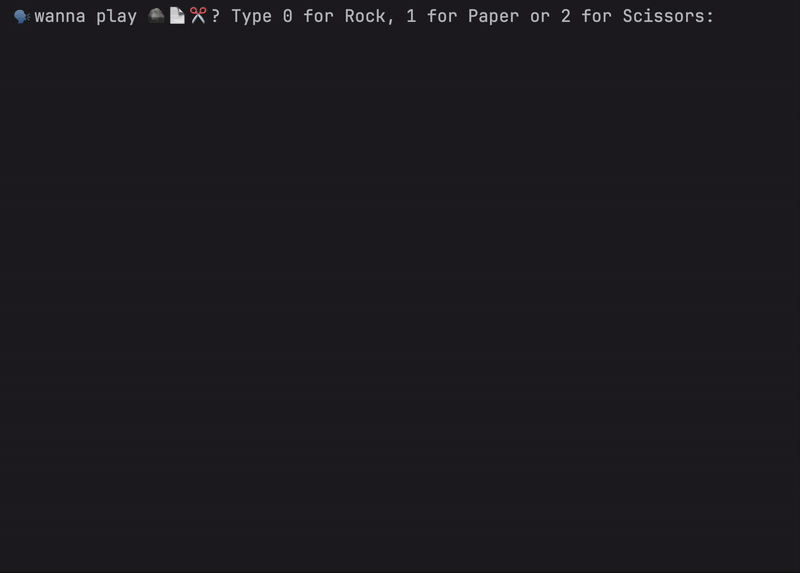

# Day 4 - Randomisation and Python Lists
## Concepts Learned
- Random Module
- Understanding the Offset and Appending Items to Lists
- Index Errors and Working with Nested Lists
## Rock Paper Scissors

