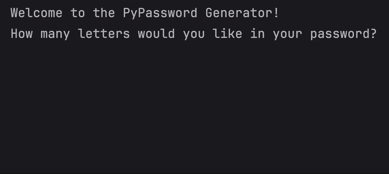

# Day 5 - Python Loops
## Concepts Learned
- Using the for loop with Python Lists
- For loops and the range() function
## Password Generator
### Generates a random, strong password with customizable counts of letters, numbers, and symbols.

