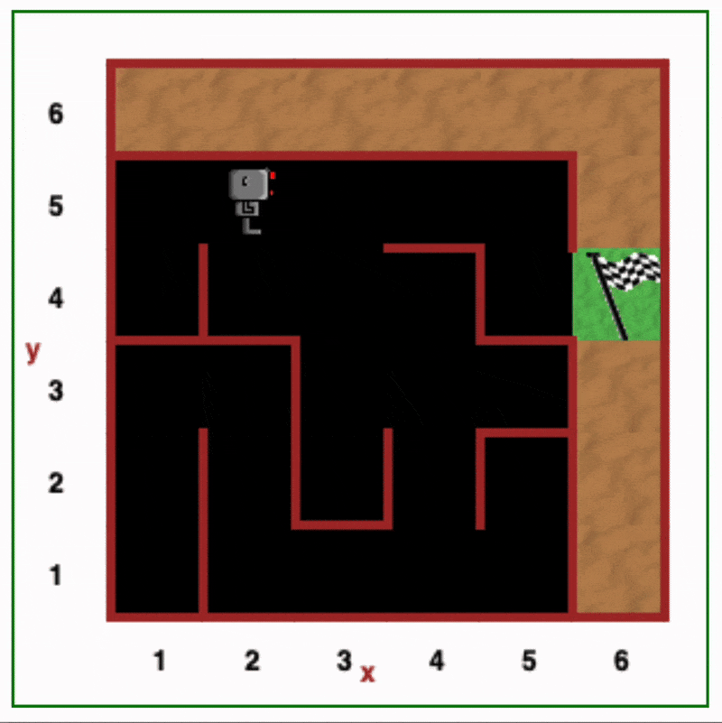

# Day 6 - Python Functions & Karel
## Concepts Learned
- Defining and Calling Python Functions
- Indentation in Python
- While Loops
## Escaping the Maze
### Solved a maze challenge using loops and functions on the Reeborg's World platform.

- [This is where the robot lives](https://reeborg.cs20.ca/?lang=en&mode=python&menu=%2Fworlds%2Fmenus%2Fsk_menu.json&name=Maze&url=%2Fworlds%2Ftutorial_en%2Fmaze1.json)
