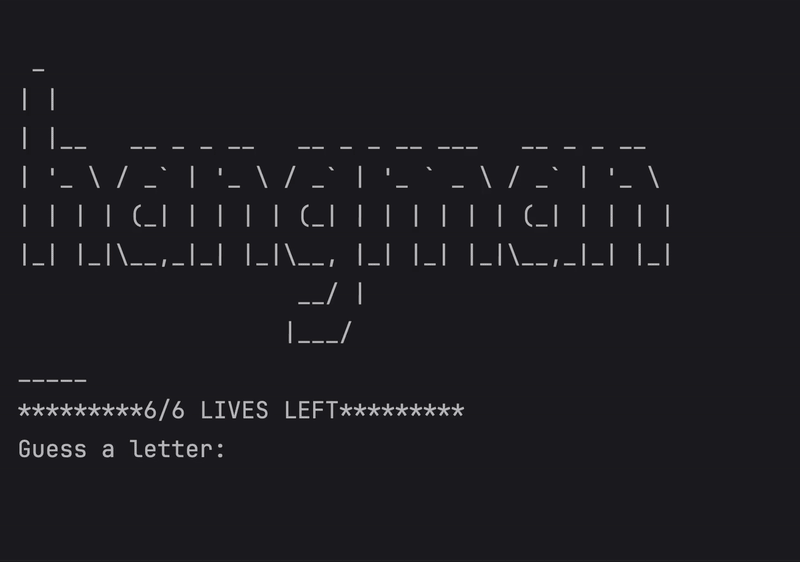

# Day 7 - Hangman
## Concepts Learned
- How to break a Complex Problem down into a Flow Chart
- Improving the User Experience
- Importing stuff from other files
## Hangman
### A word-guessing game that draws parts of a hangman figure for each wrong guess.

