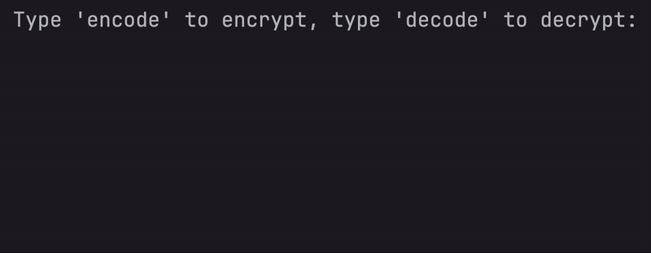
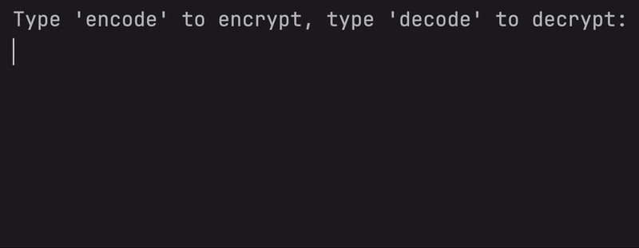

# Day 8 - Function Parameters & Caesar Cipher
## Concepts Learned
- Functions with Inputs
- Positional vs. Keyword Arguments
## Caesar Cipher
### Encrypts and decrypts messages using a Caesar cipher with user-defined shift values.

