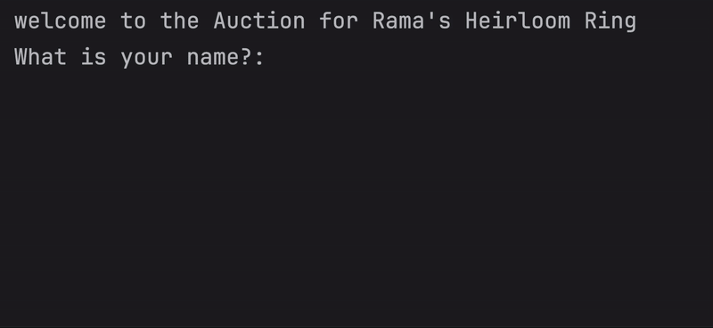

# Day 9 - Dictionaries, Nesting and the Secret Auction
## Concepts Learned
- The Python Dictionary
- Nesting Lists and Dictionaries
## The Secret Auction Program
### Simulates a blind auction where bidders input their names and bids secretly; the highest bidder wins.

