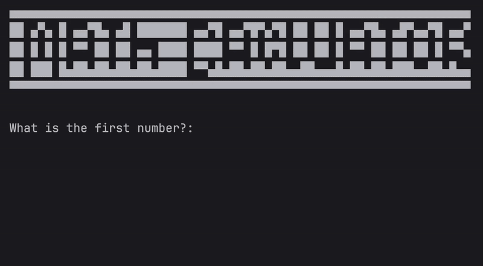

# Day 10 - Functions with Outputs
## Concepts Learned
- Function with Outputs
- Multiple return values
- Docstrings
- Combining Dictionaries and Functions
- Print vs Return
- While Loops, Flags and Recursion
## Calculator Project
### A basic calculator app that can perform chained operations (+, -, *, /) using functions and loops.

