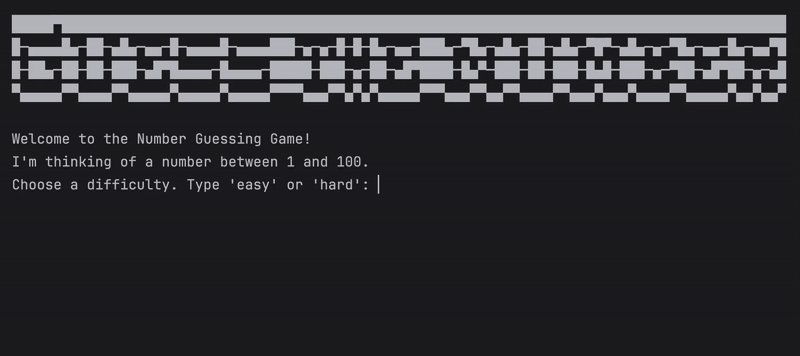

# Day 12 - Scope & Number Guessing Game
## Concepts Learned
- Local vs Global Scope
- How to Modify a Global Variable
- Python Constants and Global Scope
## The Number Guessing Game
### The computer picks a random number, and the user has to guess it within a limited number of tries.

