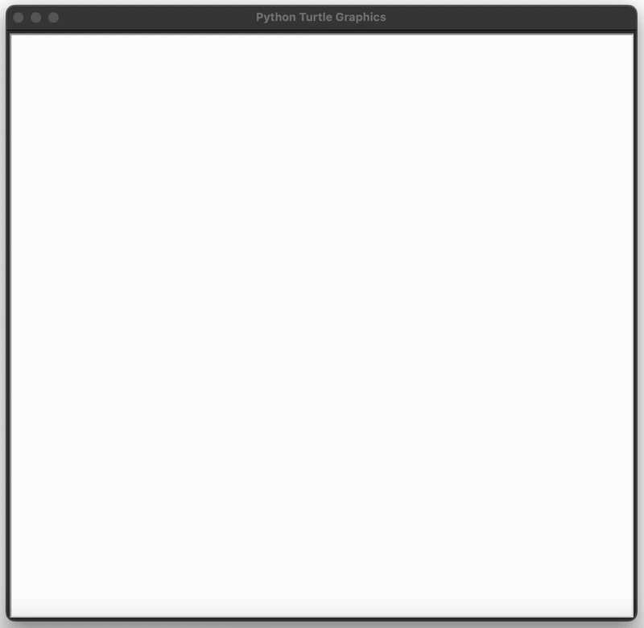

# Day 18 - Turtle & the Graphical User Interface (GUI)
## Concepts Learned
- Understanding Turtle Graphics and How to use the Documentation
- Importing Modules, Installing Packages, and Working with Aliases
- Python Tuples and How to Generate Random RGB Colours
## The Hirst Painting Project

