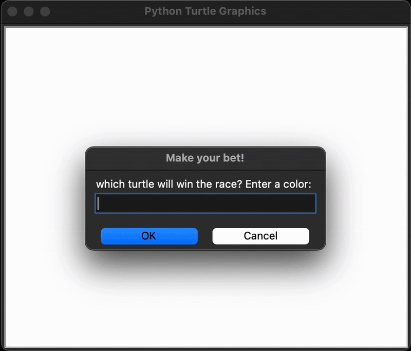

# Day 19 - Instances, State and Higher Order Functions
## Concepts Learned
- Python Higher Order Functions & Event Listeners
- Object State and Instances
- The Turtle Coordinate System
## Turtle Race

