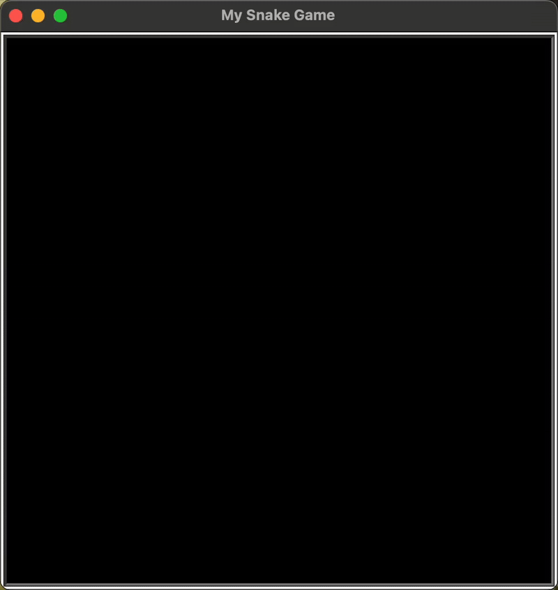

# Day 20 - Build the Snake Game Part 1: Animation & Coordinates
## Concepts Learned
- Screen Setup and Creating a Snake Body
- Animating the Snake Segments on Screen
- Create a Snake Class & Move to OOP
- How to Control the Snake with a Keypress
## Snake Game Part 1

