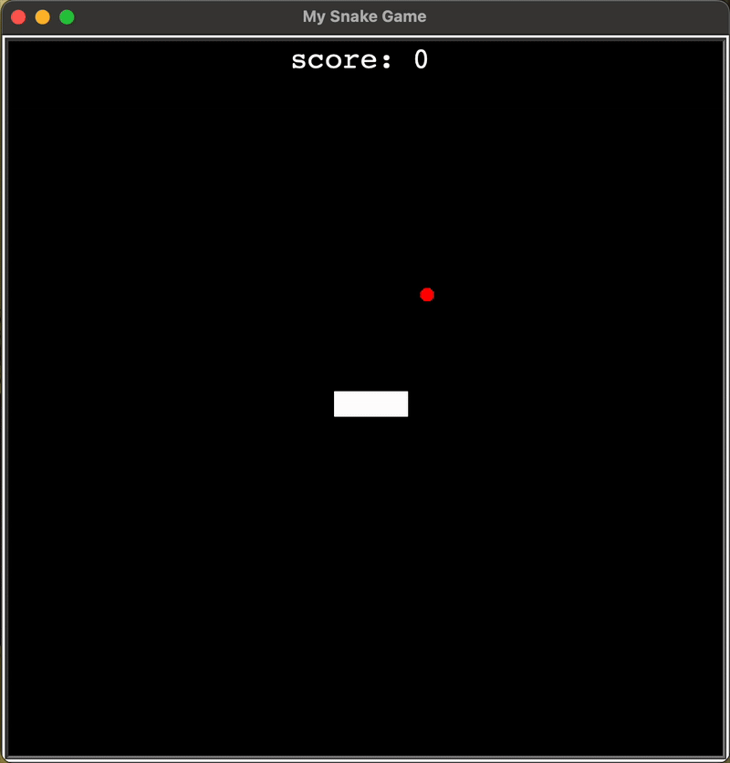

# Day 21 - Build the Snake Game Part 2: Inheritance & List Slicing
## Concepts Learned
- Class Inheritance
- How to Slice Lists & Tuples in Python
## Snake Game Part 2
### Completed the Snake game with collision detection, scoring, and game-over logic.

