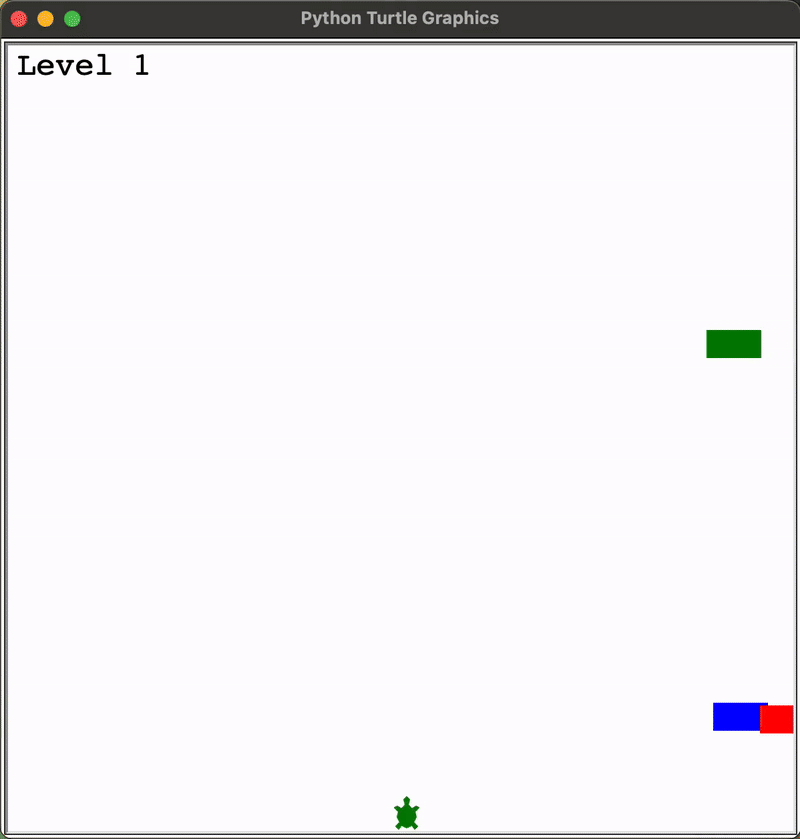

# Day 23 - The Turtle Crossing Capstone Project
## Concepts Practised
- Create a Turtle that responds to Key Presses
- Write the Car Class and Create to Randomly Spawn Cars
- How to Detect Collisions with the Cars
- How to Detect when the Turtle Crosses Sucessfully
- Score Keeping and Changing the Car Speed
## Turtle Crossing
### A game where the turtle must cross the screen without getting hit by cars. Each level gets faster.

