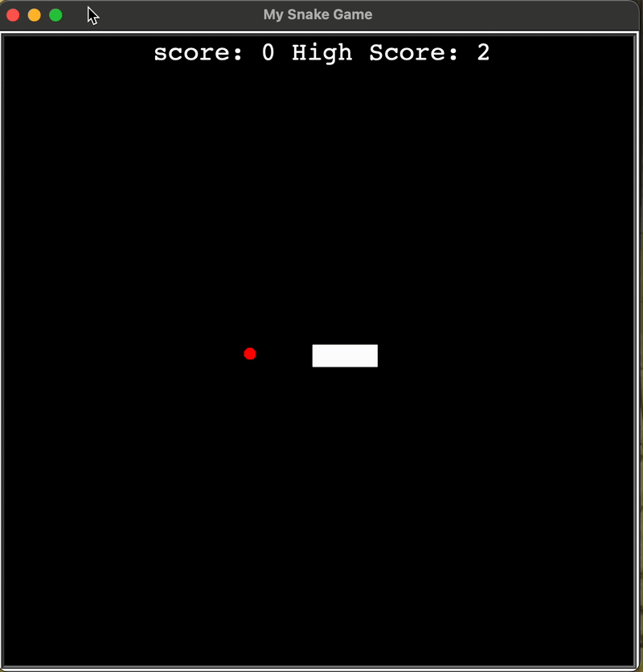

# Day 24 - Files, Directories and Paths
## Concepts Learned
- How to Open, Read, and Write to Files using the "with" Keyword
- Relative and Absolute File Paths
- Add a High Score to the Snake Game
## Snake Game with a High Score
### Added a high score feature to the Snake game using file handling to store and load scores between sessions.

## Mail Merge
### Reads a list of names and auto-generates personalized letters for each using file handling.

