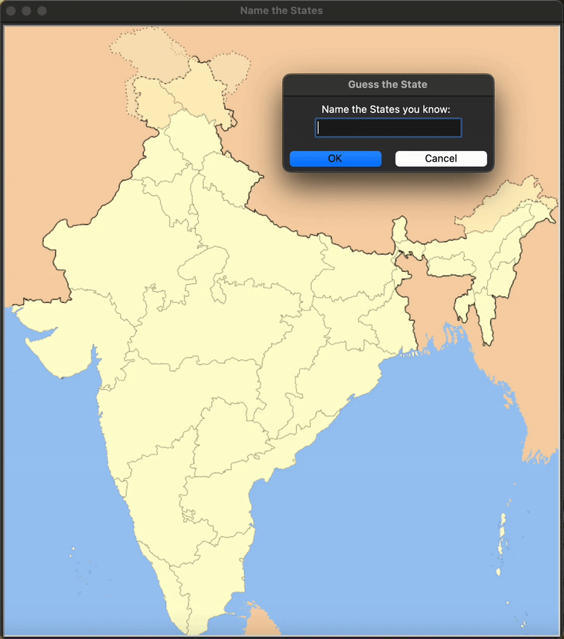

# Day 25 - Working with CSV Data and the Pandas Library
## Concepts Practised
- Reading CSV Data in Python
- DataFrames & Series
- Working with Rows & Columns
- Data Analysis with Pandas
## Guess the States Game
### Analyzed weather data using pandas and built a geography quiz game for Indian states with Python and Turtle, inspired by Angela Yu’s U.S. States game.

