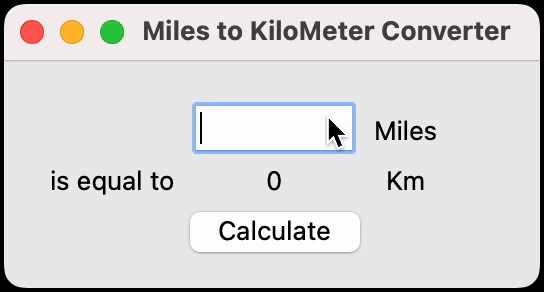

# Day 27 - Tkinter, *args, **kwargs and Creating GUI Programs
## Concepts Learned
- Creating Windows and Labels with Tkinter
- Setting Default Values for Optional Arguments inside a Function Header
- *args
- **kwargs
- Buttons, Entry, and Setting Component Options
- Other Tkinter Widgets: Radiobuttons, Scales, Checkbuttons and more
- Tkinter Layout Managers: pack(), place() and grid()
## Miles to KM Converter
### Built a simple GUI app using Tkinter that converts miles to kilometers.

