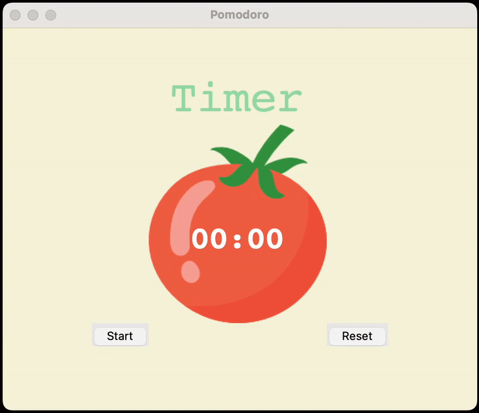

# Day 28 - Tkinter, Dynamic Typing and the Pomodoro GUI Application
## Concepts Practised
- How to work with the Canvas Widget and Add Images to Tkinter
- Add a Count Down Mechanism
- Dynamic Typing
- Setting Different Timer Sessions and Values
- Adding Checkmarks and Resetting the Application
## Pomodoro Timer
### A productivity timer app using Tkinter that follows the Pomodoro technique with work and break intervals.

