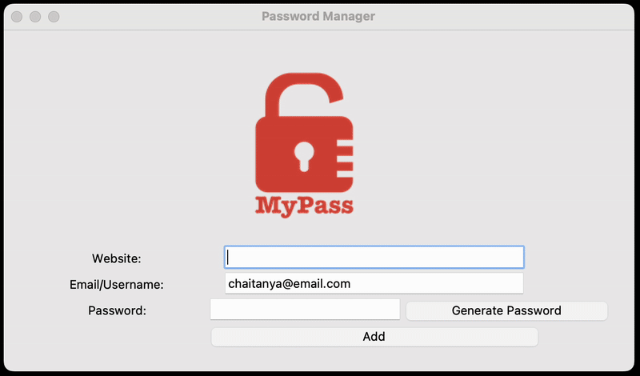

# Day 29 - Building a Password Manager GUI App with Tkinter
## Concepts Practised
- Working with Images and Setting up the Canvas
- Use grid() and columnspan to Complete the User Interface
- Saving Data to File
- Dialog Boxes and Pop-Ups in Tkinter
- Generate a Password & Copy it to the Clipboard
## Password Manager
### A GUI-based password manager using Tkinter that allows you to generate and save strong passwords.

