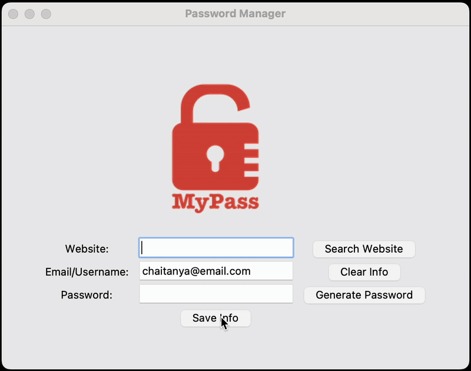

# Day 30 - Errors, Exceptions and JSON Data: Improving the Password Manager
## Concepts Practised
- Catching Exceptions: The try catch except finally Pattern
- Raising Exceptions
- IndexError Handling
- KeyError Handling
- Write, read and update JSON data in the Password Manager
## Password Manager 2.0
### Enhanced the password manager to store data in a JSON file and added search functionality for stored passwords.

